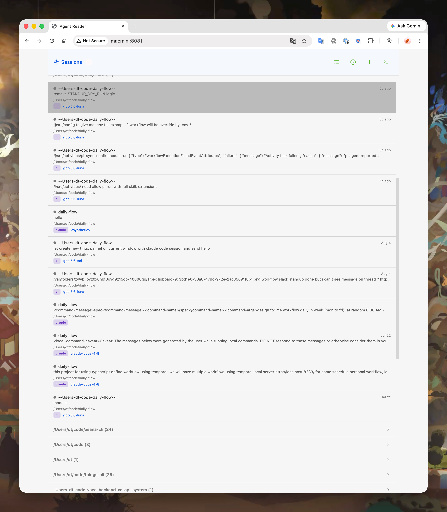
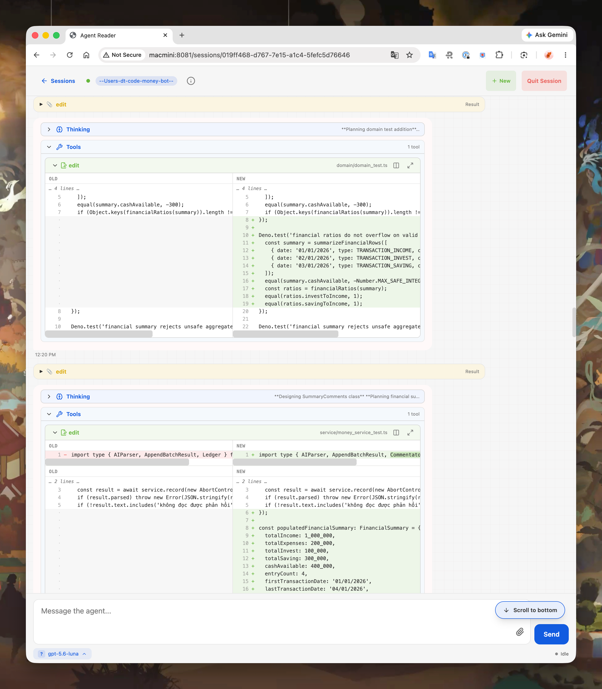

# JSONL Viewer

JSONL Viewer is a desktop and browser app for browsing and interacting with coding-agent sessions from Pi, Claude Code, and Codex.

## Screenshots





## Run

```bash
make run
```

Then open [http://localhost:8081](http://localhost:8081).
